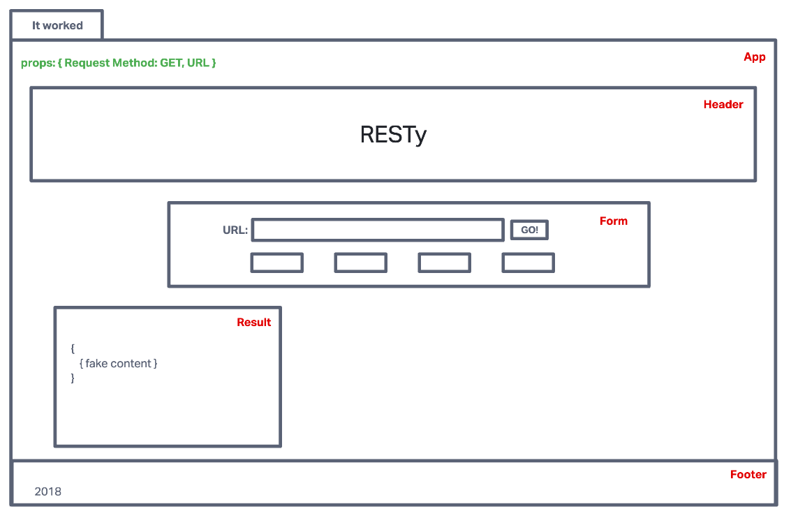

# LAB - Class 26

## Project: Component Based UI

### Author: Mandela Steele-Dadzie

### Problem Domain  

Today, we begin the first of a 4-Phase build of the RESTy application, written in React. In this first phase, our goal is to setup the basic scaffolding of the application, with intent being to add more functionality to the system as we go. This initial build sets up the file structure so that we can progressively build this application in a scalable manner

### Links and Resources

#### Tests

#### UML

Link to an image of the UML for your application and response to events

